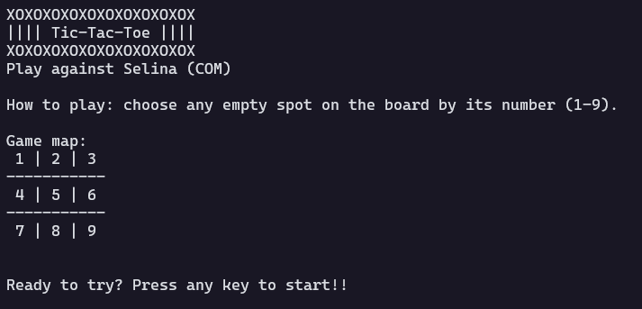

# TicTacToe Game

A text based tic-tac-toe game made in C with COM as opponent using minimax algorithm.

## Screenshots

## To-do
- [X] Make it works
- [X] Increment UI
- [X] Develop Minimax algorithm

## References
- [@adolfoguimaraes](https://github.com/adolfoguimaraes) [Algorithm and AI Professor];
- [Geeks for Geeks](https://www.geeksforgeeks.org/minimax-algorithm-in-game-theory-set-1-introduction/);
- [Wikipedia](https://en.wikipedia.org/wiki/Minimax).

## License
MIT by Wolney Oliveira
